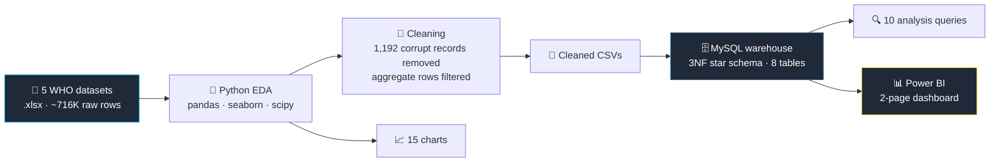

<div align="center">

# 💉 Vaccination Data Analysis & Visualization

### Global Immunization Coverage, Disease Incidence, and Programme Effectiveness — WHO, 1980–2023

**A full analytics pipeline over 479,000 WHO immunization records: Python EDA, a normalized MySQL warehouse, and an interactive Power BI dashboard — plus an explicit account of the questions this data cannot answer.**

[](https://www.python.org/)
[](https://www.mysql.com/)
[](https://powerbi.microsoft.com/)
[](https://immunizationdata.who.int/)

[]()
[]()
[]()
[]()

**Domain:** Public Health & Epidemiology · *Labmentix internship project*

</div>

---

## 📖 Overview

Five WHO datasets, joined on `country_code` + `year`, covering vaccination coverage, reported disease cases, population-normalized incidence, national programme adoption, and recommended dosing schedules.

The analysis answers four questions:

1. **Does vaccination measurably reduce disease?** — and by how much, at each coverage band
2. **Is the world meeting the WHO 95% coverage target?** — and is the gap closing or widening
3. **Where is coverage failing?** — by region, by country, and between doses of the same series
4. **Which apparent trends are real, and which are reporting artifacts?**

---

## 🏗️ Pipeline



---

## 📚 Data Sources

Five datasets from the [WHO Immunization Data portal](https://immunizationdata.who.int/):

| Dataset | Raw Rows | Contents |
|---|---:|---|
| `coverage-data` | ~400K | Coverage % by country / year / antigen |
| `reported-cases-data` | ~85K | Disease case counts |
| `incidence-rate-data` | ~85K | Population-normalized disease rates |
| `vaccine-introduction-data` | ~138K | Whether a vaccine is in the national programme |
| `vaccine-schedule-data` | ~8K | Recommended dosing schedules |

---

## 🗄️ Database Schema

Star schema in third normal form, with primary and foreign key constraints enforced.

**Dimensions**

| Table | Rows |
|---|---:|
| `countries` | 214 |
| `antigens` | 68 |
| `diseases` | 13 |

**Facts**

| Table | Rows |
|---|---:|
| `coverage` | 210,518 |
| `vaccine_introduction` | 138,320 |
| `reported_cases` | 62,655 |
| `incidence_rate` | 58,909 |
| `vaccine_schedule` | 8,052 |
| **Total** | **~479,000** |

---

## 🔍 Key Findings

### 1️⃣ Vaccination measurably reduces disease

Mean incidence falls **monotonically at every step up in coverage** — there is no band where more vaccination fails to correspond with less disease.

| Coverage Band | Mean Incidence |
|---|---:|
| Below 50% | 499.5 |
| … | *falls at every step* |
| 90–100% | **68.2** |

**86.4% reduction** from the lowest band to the highest. For measles specifically, coverage and cases correlate at **r = −0.93** (p = 2.1 × 10⁻¹⁹).

### 2️⃣ The 95% WHO target is essentially unmet

**Only 3 of 214 countries reach it.** Measles coverage peaked at **89.9% in 2012** and has since fallen to **87.8%** — a **7.2-point gap** that is widening rather than closing.

### 3️⃣ Progress reversed after 2019

Global average coverage fell from a mid-2010s peak near **89%** to **80.3% by 2023**, affecting **all six WHO regions simultaneously**. Measles cases in 2023 (**626,857**) are **85% above the 2016 low**.

### 4️⃣ Regional equity has improved dramatically

The gap between the best and worst performing region narrowed from **53.1 points in 1980** to **5.8 in 2023** — an **89% reduction**. AFRO remains lowest at **69.9%**.

### 5️⃣ Roughly 1 in 10 children never complete a multi-dose series

DTP loses **9.4 percentage points** between dose 1 and dose 3. These children are *already reached once* by the health system — which makes retention a cheaper problem to solve than first-contact access.

### 6️⃣ WPRO is an anomaly worth investigating

Second-highest mean incidence (**184.0**) despite above-average coverage (**80.4%**), suggesting regional averages are masking under-vaccinated pockets.

---

## 🧹 Data Quality

Cleaning removed **1,192 corrupt records**, including:

| Problem | Example |
|---|---|
| Coverage above 100% | One country reported **32,000%** |
| Negative dose counts | **−220 million** in one record |
| Mixed granularity | Regional, global, and World Bank grouping rows were interleaved with country-level records and had to be filtered to prevent double counting |

### Two trends that are reporting artifacts, not real change

- **Typhoid's sharp post-2016 rise** reflects surveillance expansion, not a genuine outbreak.
- **The 2020 dip in measles cases** reflects pandemic disruption to case *reporting*, not reduced disease.

Both are flagged explicitly so neither is read as a public-health signal.

---

## 🚫 Scope Limitations

Several questions in the project brief **cannot be answered with these datasets**, because WHO does not collect the required fields:

`gender` · `education level` · `urban/rural classification` · `monthly seasonality` · `population density` · `socioeconomic status` · `vaccination delivery method`

Rather than substituting unreliable proxies, these are documented as out of scope.

> **This is itself a finding.** WHO immunization data supports geographic and temporal analysis, but not demographic or socioeconomic segmentation. Any analysis claiming otherwise from this source is inventing the variable.

---

## 📂 Project Structure

```text
vaccination-data-analysis/
├── 01_Data/                                    ⚠️ not tracked — regenerate via notebook
│   ├── raw/                                    5 WHO source datasets (.xlsx)
│   └── cleaned/                                cleaned CSVs
├── 02_Python_EDA/
│   ├── vaccination-project-labmentix.ipynb     EDA notebook — 15 charts
│   └── load_data.py                            CSV → MySQL loader
├── 03_SQL/
│   ├── 01_schema.sql                           normalized schema, 8 tables
│   └── 02_analysis_queries.sql                 10 analysis queries
├── 04_PowerBI/
│   └── VaccinationProjectLabmentix.pbix        2-page interactive dashboard
└── 05_Documentation/
    ├── Vaccination Report.docx                 written report
    └── Sample_EDA_Submission_Template.ipynb
```

> 📋 **Data is not committed.** The WHO source files and derived CSVs are gitignored — download the five datasets from the WHO portal and run the notebook to regenerate them.

---

## ⚙️ Setup

```bash
pip install pandas numpy matplotlib seaborn scipy sqlalchemy pymysql
```

Then:

1. Download the five source datasets from the [WHO Immunization Data portal](https://immunizationdata.who.int/) into `01_Data/raw/`
2. Run `02_Python_EDA/vaccination-project-labmentix.ipynb` to clean the data and generate the CSVs
3. Execute `03_SQL/01_schema.sql` in MySQL Workbench
4. Set `PASSWORD` and `FOLDER` in `02_Python_EDA/load_data.py`, then run it
5. Run `03_SQL/02_analysis_queries.sql` for the analysis queries
6. Open `04_PowerBI/VaccinationProjectLabmentix.pbix` in Power BI Desktop

---

## 🔁 Reproducibility

Every stage maps to a committed file:

| Stage | File |
|---|---|
| Cleaning & EDA | `02_Python_EDA/vaccination-project-labmentix.ipynb` |
| Warehouse load | `02_Python_EDA/load_data.py` |
| Schema definition | `03_SQL/01_schema.sql` |
| Analysis queries | `03_SQL/02_analysis_queries.sql` |
| Dashboard | `04_PowerBI/VaccinationProjectLabmentix.pbix` |
| Written report | `05_Documentation/Vaccination Report.docx` |

---

## 🛠️ Tech Stack

<div align="center">


**Analysis** — pandas · NumPy · SciPy
**Visualization** — Matplotlib · Seaborn · Power BI
**Warehouse** — MySQL · SQLAlchemy · PyMySQL

</div>

---

<div align="center">

### 👤 Author

**Ankit Dash**
B.Tech CSE — Data Analytics & Machine Learning
Centurion University of Technology and Management

[](https://github.com/Ankit-builds1)

<sub>Findings are reported with their supporting statistics — and the questions this data cannot answer are named rather than approximated.</sub>

</div>
